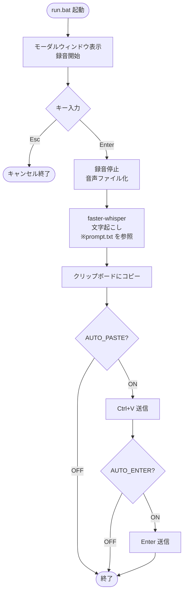

# voice-paste

## 概要

音声入力＆自動貼り付けツール。

## インストール方法

### 1. Python のインストール
- Python 3.11 以上をインストール: https://www.python.org/downloads/
- インストール時に「Add Python to PATH」にチェックを入れること

### 2. セットアップ
```
setup\setup_venv.bat
```
- venv の作成・依存ライブラリ（GPU対応含む）のインストールを自動で行います

### 3. 設定ファイルの準備
- `.env.sample` をコピーして `.env` を作成し、必要に応じて設定を変更
- `resources\prompt.txt` に用語集を記載（Whisper の誤認識防止）

## 使い方

### 起動方法
`run.bat` をダブルクリック、またはデスクトップにショートカットを作成してキーボードショートカットを割り当て

### 操作方法
1. 起動するとモーダルウィンドウが表示され、マイク録音が開始されます
2. **Enter** キーで録音確定 → 文字起こし → クリップボードにコピー
3. **Esc** キーでキャンセル終了

### 自動貼り付け・Enter送信
`.env` で以下を設定：
- `AUTO_PASTE=true` — 文字起こし後に Ctrl+V を自動送信
- `AUTO_ENTER=true` — Ctrl+V 後に Enter を自動送信

### Whisper プロンプト（用語集）
`resources\prompt.txt` に専門用語・固有名詞を記載することで誤認識を防げます

## ツール仕様

### 機能一覧



- 起動時にモーダルウィンドウを表示しマイク録音を開始
- Enter キーで録音確定、Esc キーでキャンセル終了
- 録音確定後に音声ファイル化し、faster-whisper で文字起こし
- 文字起こし結果をクリップボードにコピー
- 自動貼り付け（Ctrl+V 送信）: `.env` で ON/OFF
- 自動 Enter 送信: `.env` で ON/OFF
- Whisper プロンプト（用語集）を外部ファイルで管理し専門用語の誤認識を防止

### 入出力
- 入力: マイク音声（Enter 確定後に音声ファイル化して Whisper へ渡す）
- 出力: クリップボードへのテキストコピー ＋ 仮想キー操作（Ctrl+V / Enter）

### パフォーマンス
- GPU モード対応（faster-whisper の `device` / `compute_type` を `.env` で直接指定）
- モデルサイズを `.env` で変更可能（デフォルト: `large-v3`）

### インターフェース
- GUI: モーダルウィンドウ（tkinter）
- 起動: `run.bat`（Windows ショートカットに割り当てて使用）

### 設定（.env）
- `WHISPER_DEVICE` — デバイス指定（例: `cuda` / `cpu`）
- `WHISPER_COMPUTE_TYPE` — 量子化タイプ（例: `float16` / `int8`）
- `WHISPER_MODEL` — モデルサイズ（デフォルト: `large-v3`）
- `AUTO_PASTE` — 自動貼り付け ON/OFF（デフォルト: `true`）
- `AUTO_ENTER` — 自動 Enter 送信 ON/OFF（デフォルト: `true`）
- `PROMPT_FILE` — 用語集プロンプトファイルパス（デフォルト: `resources/prompt.txt`）

## 開発技術

- **Python** 3.11以上
- **faster-whisper** — 音声文字起こし（GPU/CPU対応）
- **sounddevice** — マイク録音
- **scipy** — 録音データのWAVファイル保存
- **pyperclip** — クリップボードへのテキストコピー
- **pynput** — キーボード仮想入力（Ctrl+V / Enter送信）
- **tkinter** — GUIモーダルウィンドウ（標準ライブラリ）

## フォルダ構成

```
voice-paste/
├── voice_paste/
│   ├── transcription/
│   │   ├── transcribable.py       # 文字起こしインターフェース
│   │   └── whisper_transcriber.py # faster-whisper実装
│   ├── audio/
│   │   └── recorder.py            # マイク録音・WAVファイル保存
│   ├── input/
│   │   └── keyboard_sender.py     # pynputによるキー送信
│   ├── __init__.py
│   ├── __main__.py
│   ├── config.py
│   ├── main.py
│   ├── gui.py
│   ├── logger.py
│   ├── exceptions.py
│   ├── constants.py
│   └── utils.py
├── setup/
│   └── setup_venv.bat
├── tests/
│   ├── mocks/
│   │   ├── mock_env.py
│   │   └── mock_externals.py
│   ├── conftest.py
│   └── transcription/
│       └── test_whisper_transcriber.py
├── resources/
│   └── prompt.txt
├── log/
│   └── .gitkeep
├── venv/
├── run.bat
├── activate.bat
├── .env.sample
├── .gitignore
├── README.md
└── pyproject.toml
```

## ライセンス

MIT
